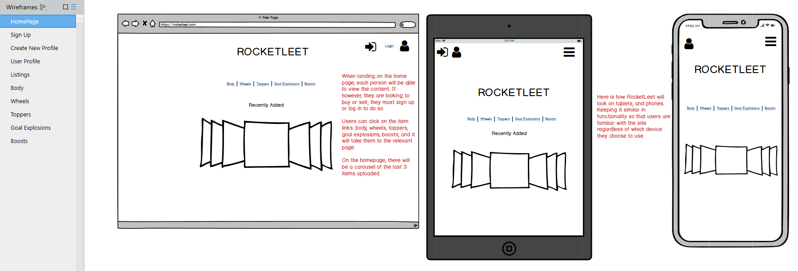
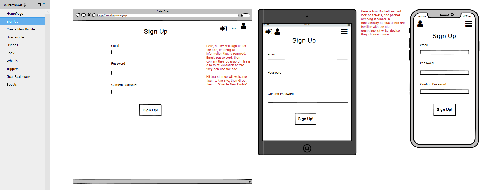

# Rocket Leet - Thomas Fisher

## Rocket Leet, the two sided market place, where you can purchase items to make your Rocket League experience that much better. Come on through, and buy buy buy! 

## Deployed Website: 	https://rocketleet.herokuapp.com/

## GitHub Repository:	https://github.com/thomasjfisher/rocketleet


## Identification of the *problem* you are trying to solve by building this particular marketplace *app*.

By creating the market place app Rocket Leet, I am eliminating the problem of users having to drive around in a boring looking car! Allowing users easier access to many items, such as car body, car boosts, car wheels, car toppers and goal explosions, Rocket Leet is an affordable way to pimp your ride!

## Why is it a *problem* that needs solving?

So, how and why is this a problem? Well, Rocket League is all about styling! You do big aerials, drop shots, trick shots, half flips and so much more! What better way to really show off than with unlimited access to a market place with multiple users and even more items for sale! 

## Description of your marketplace *app* (website), including:

### \- Purpose

Rocket League is a soccer based game, where users drive around in all sorts and styles of cars as the player. What Rocket Leet's purpose, is to allow users to have access to purchase multiple items, varying from car boosts, wheels, bodies, goal explosions and toppers for their car! Most items are earned through playing the game. But waht happens when you receive multiple of one item? Or you want to get an item now! Well, Rocket Leet eliminates that problem of having too many items, or not enough of the ones you want. By creating this market place app, Rocket Leet is fulfilling the supply and demand of users and allowing them to sell items to one another.

### \- Functionality / features

The aim of Rocket Leet is to allow users to buy and sell many items in order to create a stykish new look when playing in game! The main functinoality of the site is to buy and sell items! There is access to both creating a listing to sell, and also viewing all listings, or specific items listed, to buy. The navbar is stickied to the top of the page, so that the user will always have access to the home page, their profile, returning back one page, or logout. 

A User can then proceed to purchase an item, can click on the item they wish to purchase for more information, and then redirect to the buy page. From there, they will be redirected to their profile to view the bought item and then download it into their Rocket League inventory. 

All users have access to be a buyer and a seller. They can see who has listed what and can see other profiles made on the website.

For future implementation, Rocket Leet will have a carousel on the home page with the previous 5 added items. I would also like to implement any "hot items" that are selling well or offer some items on sale!

Another future implementation would be to connect Stripe up as it is a good feature to have.

Another feature I feel would be good to have is a messaging system so that users may interact with each other over the website.

I would also like to implement a profile picture for each profile. If no profile picture is set, then a default image would be provided.

### \- Sitemap

### \- Screenshots

### \- Target audience

Rocket Leet aims directly at gamers. More specifically, gamers who play the wonderful game called Rocket League! There is not a single gamer who does not care about the way their car looks! We are all unique in our own special ways, that no matter who you are, you can have access to Rocket Leet marketplace app to make use of the features there, and purchase any sort of item that is available! 

### \- Tech stack (e.g. html, css, deployment platform, etc)

- Ruby on Rails
- HTML
- SCSS - using Bootstrap for stlying
- Postgresql
- Heroku for delpoyment
- Amazon AWS S3 for image storage
- GitHub for source control

## User Stories

What can the user do on Rocket Leet? Below I have listed the users experience:

- A User can log in and create a new account. They will then be prompted to create a new profile if it is a new account.
- From the home page, a User can then navigate to sell an item, view their profile page, or view all listings. Lower on the home page, if a user is after a specific type of item, for example, a boost, they can see that there are 5 buttons each specifically linking to pages with only the specified item types.
- A User can buy and sell multiple items, only if they are logged in.
- A User can edit and delete their own listings only.
- A User can upload an image when creating a listing.
- A User can click on an item and see more details about the listed item. Price, description etc.
- A User can log in and out of their account. There is an option to tick a 'remember me' option, making user experience much better.
- A User can see what items they have listed to sell on via their profile page.
- A User can see the items they have purchased on their profile page.

## Wireframes





## ERD


## Explain the different high-level components (abstractions) in your app

#### Models:

Rocket Leet has the following models:

#### User

A user will be asked to create an account when landing on the Rocket Leet home page. Here they will set up an account, with email and password. The entire app depends on a User being created.

#### Profile

A user will be redirected to create a profile after signing up. They can select a first and last name for their profile, and will be assigned a profile id number. The profile id is very important, as the rest of the app depends on a user have a profile id and a user id too, in order to track what items are listed and by whom, and who and what items are being bought.

#### Category

Category is where the Listings are sorted. Only the items assigned a specific category id will show in a specific category page. Ie, items with a category id of 1 will show on the Body page, as the category id for Body is 1. Items with a category id of 2 will show on the Wheels page, as the category id for Wheels is 2. with a category id of 3 will show on the Toppers page, as the category id for Toppers is 3. with a category id of 4 will show on the Goal Explosions page, as the category id for Goal Explosions is 4. with a category id of 5 will show on the Boost page, as the category id for Boost is 5.

#### Listing

Listings is where the items that a user is selling are stored. From there, the user can add more listings in order to sell, or they can purchse other items from other users. Listing is dependant on all of the other tables in order to match up users with items.

#### Controllers

*apllication_controller* has functions for the whole application. I have passed to authenticate user whe they log in to redirect to create a profle if they are a new user.

*buyer_controller* here I am finding who the buyer is. It will get their current profile id and match them as the buyer.

*categories_controller* here the controller is looking after the Listings items and sorting by categories.

*home_controller* this is the controller for the home page

*listings_controller* here the controller is sorting all of the items listed and bought on the database. This would not be possible without the user id's and profile id's.

*profiles_controller* the controller handles the profile id and what items each profile has listed and bought.

#### Views

<u>*Buyer*</u> handles the page where a user purchases an item.

<u>*Categories*</u> handles the views of the categories page styling

*<u>Home</u>* the home page layout. Most of the site layout is directed from here

<u>*Listings*</u> the listings layout is handled here, create listing, view listing etc

<u>*Partials*</u> here I have a navbar which appears on each page. It is stickied at the top of each page so that a user will always have access to it, as there are all the sites directions located on the navbar.

<u>*Profiles*</u> here the bought and listed items are stored and styled for each profile.

## Detail any third party services that your app will use

Third party services used by Rocket Leet is Amazon Web Service S3. This is where all of the images that are upoaded to Rocket Leet will be held. The purpose of using Amazon S3, is to make for the best user experience possible. Having an app that operates fast is vital, as users want to get what they want at a resonable pace. Making use of Amazon S3 makes sure that the site will stay at a good quality speed, allowing for the best possible user experience.

## Describe your projects models in terms of the relationships (active record associations) they have with each other

The Models that are used in the creation of Rocket Leet are:

#### User

A User has a one and only one relationship with Profile.The User model was created so that Users can create an account and use the site.  A User can edit their Profile, but they can only have one Profile per account. 

#### Profile

The Profile model was created to *belong_to* User. In doing this, the app is able to keep track of the User id and the Profile id. A Profile  *has_many :listings_to_buy*, and  *has_many :listings_to_sell*. The purpose of this is so that a Profile may create as many Listings as they wish, and so that all of the Listings the Profile creates, has only one Profile so that it is visible where items are going, and who created what Listings, and to see which Profile has bought which Listing.

#### Category

The Category model *has_many* Listings. Each of the categories, Body, Wheels, Toppers, Goal Explosions and Boosts, can have many Listings. 

#### Listing

The Listing model *belongs_to* Category. Each Listing also *belongs_to* Profile, in order to provide the buyer and seller id. This ensure that a Profile can have many listings for sale and also can purchase many listings. 

## 18Discuss the database relations to be implemented in your application


## Provide your database schema design

#### The Users Schema:

```
create_table "users", force: :cascade do |t|
    t.string "email", default: "", null: false
    t.string "encrypted_password", default: "", null: false
    t.string "reset_password_token"
    t.datetime "reset_password_sent_at"
    t.datetime "remember_created_at"
    t.datetime "created_at", precision: 6, null: false
    t.datetime "updated_at", precision: 6, null: false
    t.index ["email"], name: "index_users_on_email", unique: true
    t.index ["reset_password_token"], name: "index_users_on_reset_password_token", unique: true
  end
```

The User model was generated by a Ruby Gem called Devise. This adds validation, verification and encryption to our log in. A User cannot navigate Rocket Leet without signing up and creating an account.

#### The Profiles Schema:

```
  create_table "profiles", force: :cascade do |t|
    t.string "first_name"
    t.string "last_name"
    t.bigint "user_id", null: false
    t.datetime "created_at", precision: 6, null: false
    t.datetime "updated_at", precision: 6, null: false
    t.index ["user_id"], name: "index_profiles_on_user_id"
  end
```

The Profile model waas generated in order to allow the User access to their own information, bought items, and listed items. It requires a user to be created. Having the Profile and User id is what ties a lot of the site together in regards to the purchasing and selling of items.

#### The Category Schema:

```
  create_table "categories", force: :cascade do |t|
    t.string "name"
    t.datetime "created_at", precision: 6, null: false
    t.datetime "updated_at", precision: 6, null: false
  end
```

The purpose of the Category model is so that users may have an option to specify which items they would like to see. There are options to 'View All Listings' on the home page, and there are also options to view 'Body, Wheels, Toppers, Goal Explosions and Boosts'. Categories makes for a much better and simpler user experience.

#### The Listings Schema:

```
create_table "listings", force: :cascade do |t|
    t.string "item_name"
    t.bigint "category_id", null: false
    t.text "description"
    t.float "price"
    t.integer "seller_id"
    t.integer "buyer_id"
    t.bigint "profile_id", null: false
    t.datetime "created_at", precision: 6, null: false
    t.datetime "updated_at", precision: 6, null: false
    t.string "picture"
    t.index ["category_id"], name: "index_listings_on_category_id"
    t.index ["profile_id"], name: "index_listings_on_profile_id"
  end
```

The purpose of the Listings model is to give all information required when a user is listing an item for sale. Users will be asked for the 'Item Name', 'Category', 'Description', 'Price' and 'Upload a Picture'. On the back end, Lisings also creates the *users seller_id*, *buyer_id* and *profile_id* all based on the User model and the Profile model.

#### Active Storage Schema:

```
create_table "active_storage_attachments", force: :cascade do |t|
    t.string "name", null: false
    t.string "record_type", null: false
    t.bigint "record_id", null: false
    t.bigint "blob_id", null: false
    t.datetime "created_at", null: false
    t.index ["blob_id"], name: "index_active_storage_attachments_on_blob_id"
    t.index ["record_type", "record_id", "name", "blob_id"], name: "index_active_storage_attachments_uniqueness", unique: true
  end

  create_table "active_storage_blobs", force: :cascade do |t|
    t.string "key", null: false
    t.string "filename", null: false
    t.string "content_type"
    t.text "metadata"
    t.bigint "byte_size", null: false
    t.string "checksum", null: false
    t.datetime "created_at", null: false
    t.index ["key"], name: "index_active_storage_blobs_on_key", unique: true
  end

```

The Active Storage tables are for the image upload, and also the attachments of the image uploads.

#### Foreign Keys Schema:

```
  
  	add_foreign_key "active_storage_attachments", "active_storage_blobs", column: "blob_id"
    add_foreign_key "listings", "categories"
    add_foreign_key "listings", "profiles"
    add_foreign_key "profiles", "users"
  end
```

Here are the foreign keys that were required for the project.

## Describe the way tasks are allocated and tracked in your project

Throughout the project, I made use of a Trello board for the main tasks of the app, and I used an Evernote page to keep myself on track from day to day tasks. The main Trello board functions were:

- Upcoming Tasks
- In Progress
- Testing
- Complete